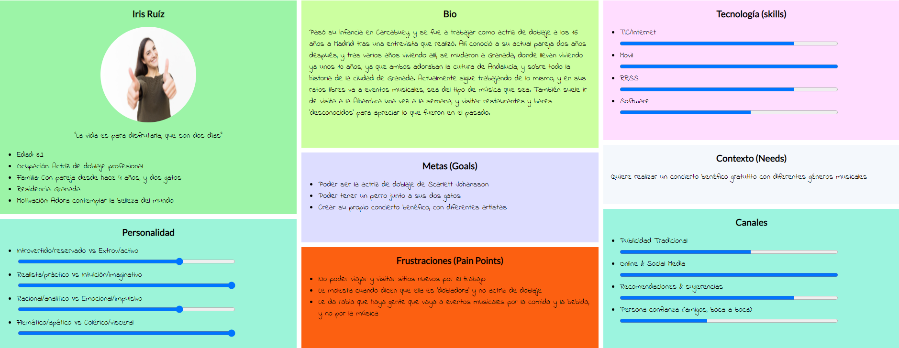
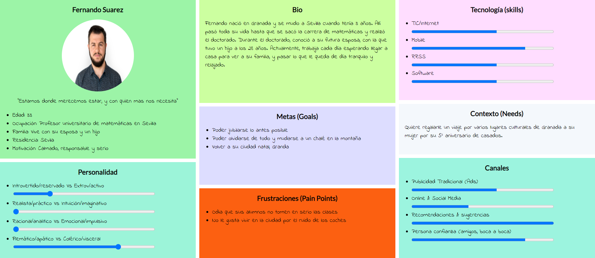
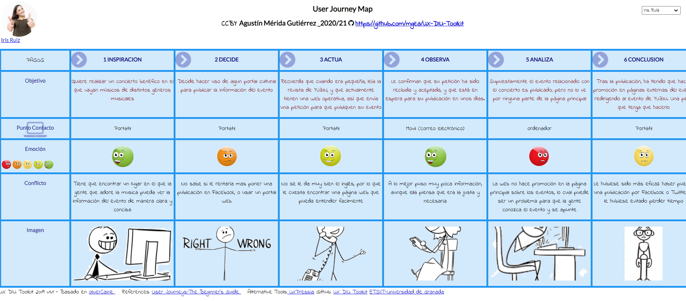
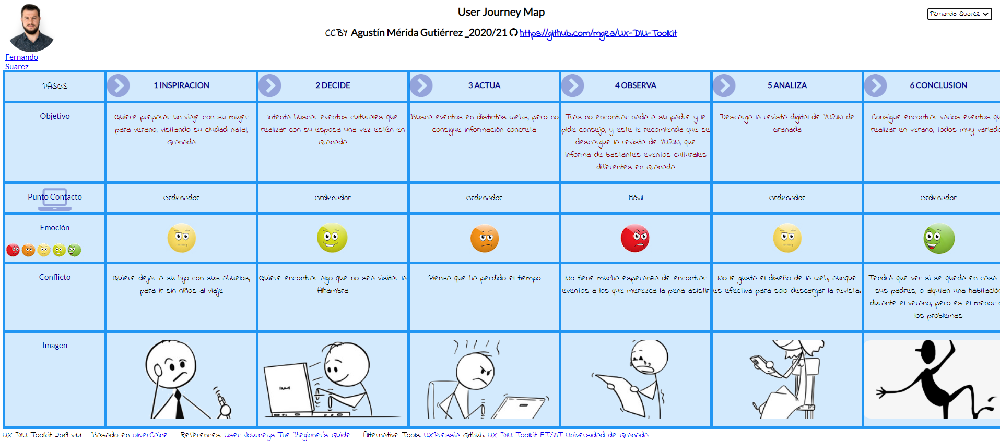

# DIU21-EjercicioFinal

Repositorio en el que se pondrá lo correspondiente a la parte 2 del examen final de la asignatura de Diseño de Interfaces de Usuario del curso 20/21
Autor: Agustín Mérida Gutiérrez

La parte 2 del examen de DIU consiste en realizar un Caso de estudio de la web [YUZIN](https://yuzin.com/wp-content/uploads/2021/06/YUZIN-GRANADA-junio-2021.pdf). Para ello, haremos uso de la estructura planteada en prácticas, solo que un poco simplificada, para no alargar mucho la longitud de lo que sería esta parte de la entrega.

Antes de nada, debemos tener en cuenta que YUZIN es una web que informa de eventos culturales en distintas ciudades (Granada, Sevilla y Málaga). Sobre todo, tal y como se nos indica en el guión, es una web que ofrece la versión digital de su revista, aunque si vemos cómo es actualmente la web, es bastante diferente a lo planteado.

## Paso 1. UX Desk Research & Analisis

En este apartado, realizaremos el análisis de la experiencia de dos usuarios usando esta página web, con el objetivo de encontrar los puntos positivos y negativos de la página web, para más adelante tenerlos en cuenta en la revisión del diseño, para ver que se debería cambiar y que no.

### 1.a Competitive Analysis

En la versión proporcionada por el guión, la web era simplemente un portar donde descargar la versión digital de la revista, ya fuese de Sevilla o de Granada. 

Actualmente, Yazin es una página web que principalmente publica artículos de opinión de diversas personas sobre temas relacionados con la cultura, además de informar sobre varios eventos publicados (los cuales son de pago) y mostrando experiencias de usuario de varios espacios culturales, dando también la oportunidad de subscribirse a lo que sería la empresa para obtener ventajas, como ofertas en la web, o acceso a contenido exclusivo (el coste de la subscripción tiene varios tiers, y es mensual, trimestral, semestral o anual). Sin embargo, ahora ofrecer la descarga de la revista digital es algo más secundario, pero aun así sigue activo. 

Si le echamos un vistazo rápido a todos los apartados, se puede ver que hay varios apartados visuales que mejorar, si no todos (la parte correspondiente a la subscripción y la forma de contactar con la empresa no está del todo mal), por lo menos en cuanto a la manera de como organizarlo todo, ya que tal y como está actualmente, no habrá mucha gente que use la página, al menos para usar las características que ofrece, sin contar la descarga de la revista, que aunque ahora es una opción que está más escondida, puede dar juego a que la gente acceda a la web. 

### 1.b Persona

Vamos a seleccionar a dos personas, siendo una de ellas apasionada de la cultura, y otra de ellas un poco desatendida de los temas culturales, pero por situaciones personales necesita conocer algún evento cultural interesante al que asistir con su pareja. 

### 1.c User Jorney Map

Ambas personas van a tener experiencias totalmente distitnas debido a su personalidad y sus metas, siendo Iris una apasoniada de los eventos culturales que desea realizar uno, y Fernando una persona que por visitar su ciudad natal con su mujer durante verano, tiene que buscar eventos culturales que no sean simplemente visitar la Alhambra.

### 1.d Usability Review
* Para acceder al documento completo, pinche [aquí](ur.pdf)
* Valoración final: algo / 100
* 

