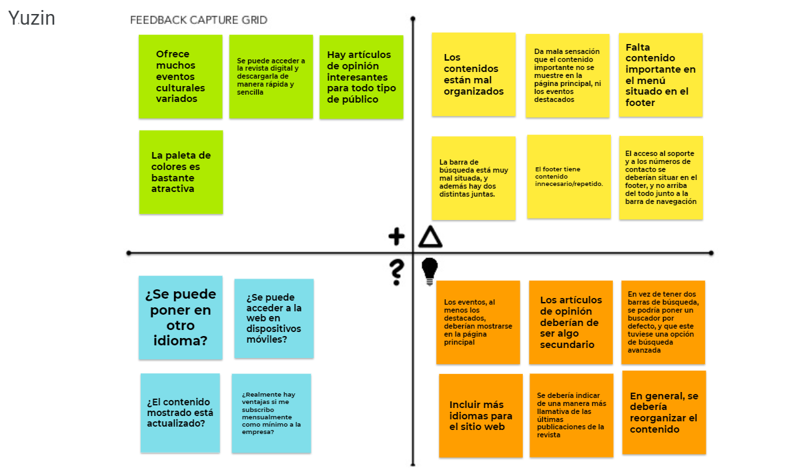
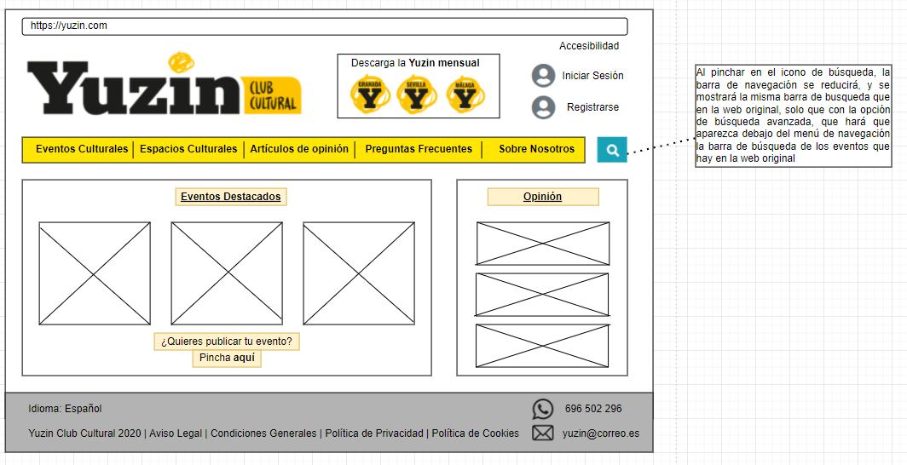
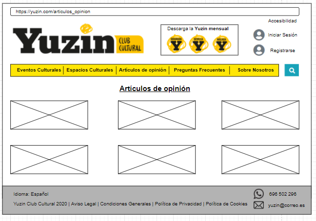
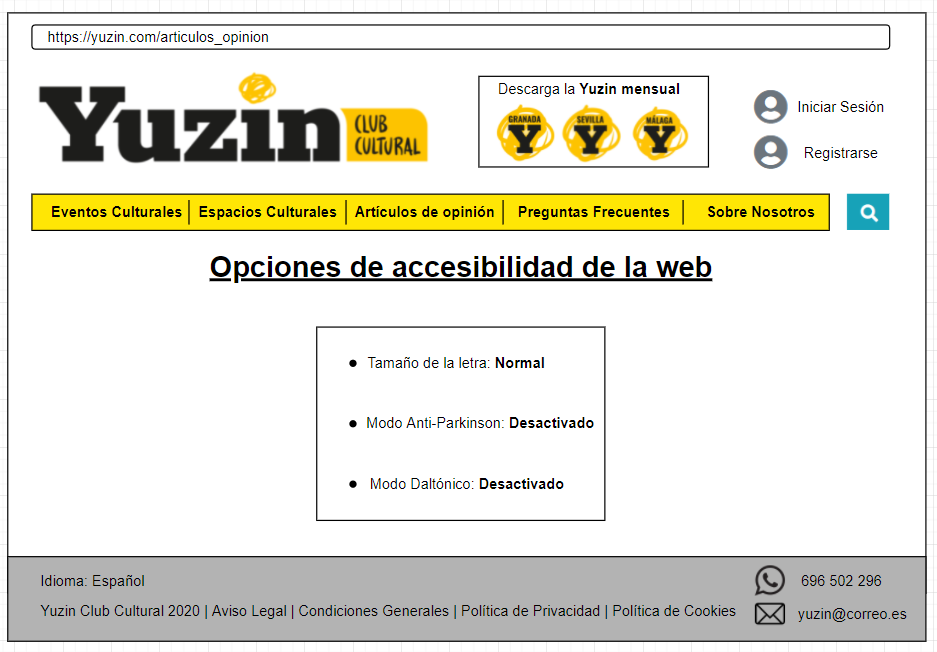

# DIU21-EjercicioFinal

Repositorio en el que se pondrá lo correspondiente a la parte 2 del examen final de la asignatura de Diseño de Interfaces de Usuario del curso 20/21
Autor: Agustín Mérida Gutiérrez

La parte 2 del examen de DIU consiste en realizar un Caso de estudio de la web [YUZIN](https://yuzin.com/wp-content/uploads/2021/06/YUZIN-GRANADA-junio-2021.pdf). Para ello, haremos uso de la estructura planteada en prácticas, solo que un poco simplificada, para no alargar mucho la longitud de lo que sería esta parte de la entrega.

Antes de nada, debemos tener en cuenta que YUZIN es una web que informa de eventos culturales en distintas ciudades (Granada, Sevilla y Málaga). Sobre todo, tal y como se nos indica en el guión, es una web que ofrece la versión digital de su revista, aunque si vemos cómo es actualmente la web, es bastante diferente a lo planteado.

## Paso 1. UX Desk Research & Analisis

En este apartado, realizaremos el análisis de la experiencia de dos usuarios usando esta página web, con el objetivo de encontrar los puntos positivos y negativos de la página web, para más adelante tenerlos en cuenta en la revisión del diseño, para ver que se debería cambiar y que no.

### 1.a Competitive Analysis

En la versión proporcionada por el guión, la web era simplemente un portar donde descargar la versión digital de la revista, ya fuese de Sevilla o de Granada. 

Actualmente, Yazin es una página web que principalmente publica artículos de opinión de diversas personas sobre temas relacionados con la cultura, además de informar sobre varios eventos publicados (los cuales son de pago) y mostrando experiencias de usuario de varios espacios culturales, dando también la oportunidad de subscribirse a lo que sería la empresa para obtener ventajas, como ofertas en la web, o acceso a contenido exclusivo (el coste de la subscripción tiene varios tiers, y es mensual, trimestral, semestral o anual). Sin embargo, ahora ofrecer la descarga de la revista digital es algo más secundario, pero aun así sigue activo. 

Si le echamos un vistazo rápido a todos los apartados, se puede ver que hay varios apartados visuales que mejorar, si no todos (la parte correspondiente a la subscripción y la forma de contactar con la empresa no está del todo mal), por lo menos en cuanto a la manera de como organizarlo todo, ya que tal y como está actualmente, no habrá mucha gente que use la página, al menos para usar las características que ofrece, sin contar la descarga de la revista, que aunque ahora es una opción que está más escondida, puede dar juego a que la gente acceda a la web. 

### 1.b Persona

Vamos a seleccionar a dos personas, siendo una de ellas apasionada de la cultura, y otra de ellas un poco desatendida de los temas culturales, pero por situaciones personales necesita conocer algún evento cultural interesante al que asistir con su pareja. 

### 1.c User Jorney Map

Ambas personas van a tener experiencias totalmente distitnas debido a su personalidad y sus metas, siendo Iris una apasoniada de los eventos culturales que desea realizar uno, y Fernando una persona que por visitar su ciudad natal con su mujer durante verano, tiene que buscar eventos culturales que no sean simplemente visitar la Alhambra.

### 1.d Usability Review
* Para acceder al documento completo, pinche [aquí](Usability-review-scores.pdf)
* Valoración final: 68 / 100
* Opinión: En general, la página web de YUZIN una vez se ve su contenido a fondo, no está mal del todo. Sin embargo, al mostrar en el home como contenido principal varios artículos de opinión, y no mostrar en grande la opción de descargar la revista digital, da la sensación de que la página ya no se centra en los eventos culturales, lo cual es mentira, ya que informa de bastantes eventos culturales en un apartado específico. A esto, se le suma que muchos apartados importantes están por alguna razón en el footer, o bien apartados que había en el menu de navegación se repiten de nuevo en el footer. Como conclusión, podemos ver que la página en sí no ofrece mal contenido, si no que este tiene que ser reestructurado.

## Paso 2. UX Desing

Como únicamente vamos a realizar el rediseño de la web, y no hacerla de cero, no se realizará el ScopeCanvas que hemos visto tanto en teoría como en prácticas, el cual es bastante útil para organizar las ideas. Sin embargo, las mejoras las podemos obtener todas de la Feedback Capture Grid, por lo que únicamente haremos esta matriz, se redactará la propuesta de rediseño planteada, y ejemplos de varios wireframes posibles. 

### 2.a Feedback Capture Grid y propuesta de rediseño

En cuanto al diseño, se propone cambiar varios aspectos, principalmente la organización del contenido. En la página principal, se deberían visualizar los eventos destacados y distintos enlaces a artículos de opinión importantes recientes. Además, el menú de navegación se reorganizaría, indicando el contenido fundamental en este (publicar tu propio evento debería de estar en el apartado de eventos culturales, y no en el menu de opciones, al menos en cuanto a tenerlo todo organizado que es lo que se desea). El apartado de preguntas frecuentes del footer se situaría en este menu de navegación, y dentro de él iría todo el contenido relevante en el apartado de ayudas que tiene el footer actualmente. También, el apartado contactanos se cambiaría a un "sobre nosotros" indicando información de la empresa y su función actual. En cuanto al menú de subscripción, este se situaría ahora dentro del apartado de la revista digital, y la descarga de la revista digital en vez de estar en esa zona, estaría en la página principal, a un click del usuaro, para así tener de manera más accesible una de las funciones principales y más importantes de la web.

### 2.b Wireframes

En cuanto a los bocetos, se ha ideado realizar los de la web, ya que se nos ha proporcionado una web que no tiene versión para móvil (no es del todo responsive). Se van a proporcionar los bocetos de la página principal, y el menú de las opiniones (el de los eventos sería el mismo que ya hay, pero sería coger la plantilla y aplicarla al apartado de opiniones que se ha proporcionado. También del menú de accesibilidad, que este en principio no abarcaría muchas opciones, pero conforme a más personas tuviesen problemas a usar la web, estas opciones irían incrementando. El resto de apartados no mencionados no se han rediseñado, ya que en mi opinión, su contendio es bastante simple y claro (el apartado de contactanos, publicar un evento, etc). Esto no significa que estén bien ni mal, solo que para mi, el diseño actual es aceptable, sencillo y bastante intuitivo, que es lo que busco con los diseños mostrados a continuación:

* Página principal

* Artículos de opinión (la página de eventos sería similar, pero con los estilos y distribución ya establecidos, usando en todo caso más espacio por cuadro de evento)

* Menú de accesibilidad

Para concluir con este apartado, se quiere aclarar que el rediseño lo he realizado enfocado en simplificar todo el contenido mostrado en la página principal y reorganizarlo todo, mostrando los contenidos relevantes siendo estos los eventos, y las descargas directas de la revista mensual en pdf. En cuanto a los artículos de opinión y accesibilidad, se ha realizado para mostrar un ejemplo de menu de opciones (menú de accesibilidad) y otro que sea mostrar lista de contenido, ya que tal y como se muestra el contenido en los subapartados (espacios culturales, contactar con ellos, la subscripción, etc) me parece bastante limpio y simple, mostrando el contenido de manera clara y concisa, aunque en cada una de estas páginas, la parte superior de la web sería similar a la del rediseño, para así aprovechar el espacio y mostrar el contenido lo antes posible. Otro detalle, es que he decidido limpiar un poco el contenido del footer (ya que personalmente, el footer con mucho contenido me molesta a mi) y se ha añadido en este la opción del idioma de la web (la página tendría que tener al menos el inglés disponible junto al español).

## Paso 3. Rediseño de la web

### 3.a Moodboard

### 3.b Guidelines

## Paso 4 Análisis de la usabilidad y la accesibilidad de la web

## Conclusión
